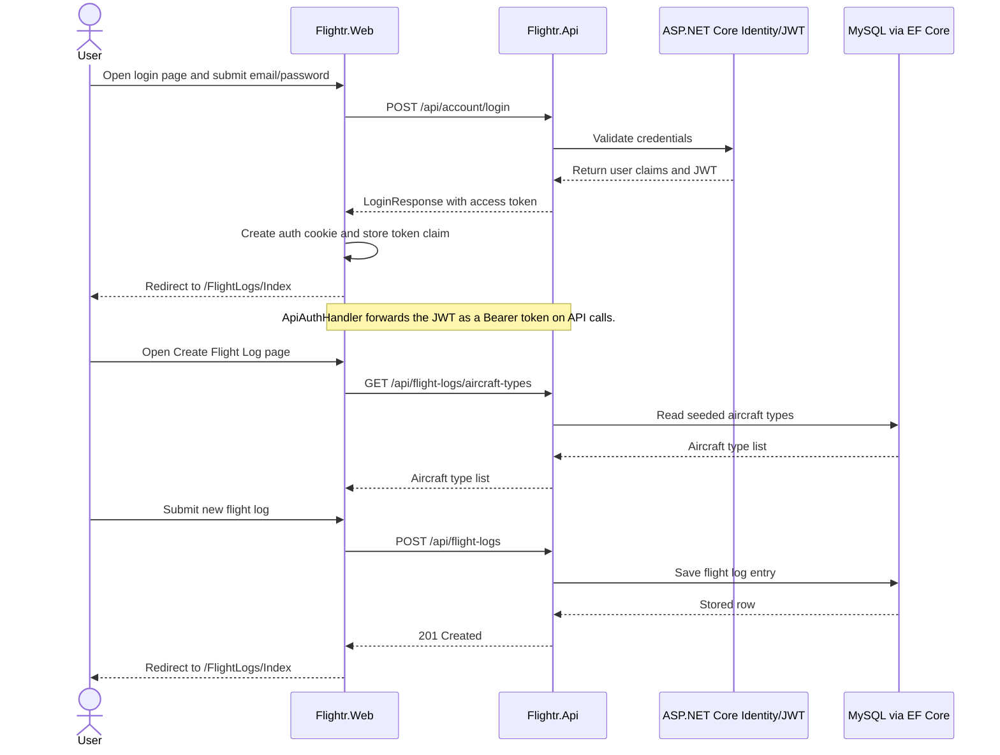

# Flightr

Flightr helps pilots track flight log entries and progress toward a pilot license. The solution contains a Razor Pages front end, a C# Web API middle tier, and a shared data library with EF Core models.

## Vision statement

For private and commercial pilots who want a clear, trustworthy record of their training progress, Flightr is a simple web app that lets you log the FAA-required basics quickly after each flight. Unlike spreadsheets or generic logbook apps, Flightr keeps the focus on staying current, tracking progress, and preparing for checkrides, with an easy-to-use interface and reliable back-end storage. Use it to track the time and experience you need to earn your private or commercial pilot's license.

## Features

Flightr helps pilots keep a simple, accurate record of their flying. Key features:

- Easy sign-up and account management: create an account, log in, and update your pilot profile (name, license details, goals).
- Secure access: passwords and sessions are handled securely; the site also issues tokens for API access.
- Personal flight logs: add, edit, and remove your flight entries — only you can see your logs.
- Downloadable records: export your flight logs as a CSV file for backup or sharing.
- Built-in aircraft list: pick common aircraft types from a pre-filled list.
- Password recovery: request a password reset link via email if you forget your password.

All features are available through the website UI; developers can also interact programmatically with the API.

## Architecture Overview

This solution is split into three logical tiers:

- Frontend (Presentation): Razor Pages application in `Flightr.Web`.
	- Built with ASP.NET Core Razor Pages and server-rendered HTML/CSS/JS.
	- Static assets served from `wwwroot` (Bootstrap, jQuery, site.css, site.js).
	- Responsible for user-facing views like login, register, profile, and flight log pages.

- Middle tier (API / Business Logic): `Flightr.Api`.
	- ASP.NET Core Web API hosting controllers (e.g. `AccountController`, `FlightLogsController`).
	- Uses ASP.NET Core Identity for user management and JWT for API authentication.
	- Exposes REST endpoints under `/api/*` and a Swagger UI at `/swagger` in Development.
	- Talks to the database via Entity Framework Core (`Flightr.Data` DbContext).

- Backend (Database / Data Layer): MySQL (MariaDB-compatible) accessed via EF Core.
	- Connection string configured in `Flightr.Api/appsettings*.json` (DefaultConnection).
	- EF Core migrations live in `Flightr.Data/Migrations` and are applied to create tables such as `AspNetUsers`, `FlightLogs`, and `AircraftTypes`.

## Architecture Diagram

## Login and Flight Log Sequence

## MC/DC Test Map

The frontend test project is organized around the main decision points in the page models:

- [Flightr.Web.Tests/AccountPagesTests.cs](Flightr.Web.Tests/AccountPagesTests.cs): login, register, logout, and the claim/token branches used by sign-in.
- [Flightr.Web.Tests/AccountRecoveryPagesTests.cs](Flightr.Web.Tests/AccountRecoveryPagesTests.cs): forgot-password and reset-password success, error-code, validation, and fallback paths.
- [Flightr.Web.Tests/FlightLogsPagesTests.cs](Flightr.Web.Tests/FlightLogsPagesTests.cs): create/edit/delete flow control, including missing user IDs, not-found cases, redirects, and API failures.
- [Flightr.Web.Tests/ProfileAndIndexTests.cs](Flightr.Web.Tests/ProfileAndIndexTests.cs): home-page auth redirect and profile load/save branches.
- [Flightr.Web.Tests/ApiAuthHandlerTests.cs](Flightr.Web.Tests/ApiAuthHandlerTests.cs): bearer-token forwarding behavior for API requests.

MC/DC helped narrow these tests to the specific choices each page model makes instead of only checking a generic success or failure path. That meant adding separate cases for missing versus present user IDs, valid versus invalid tokens, known versus unknown API error codes, JSON versus non-JSON responses, and redirect versus page-return outcomes. The result is a more precise test suite that shows exactly which condition changed the behavior and makes gaps in frontend logic easier to spot.

